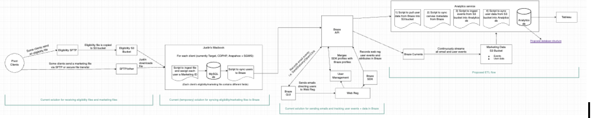
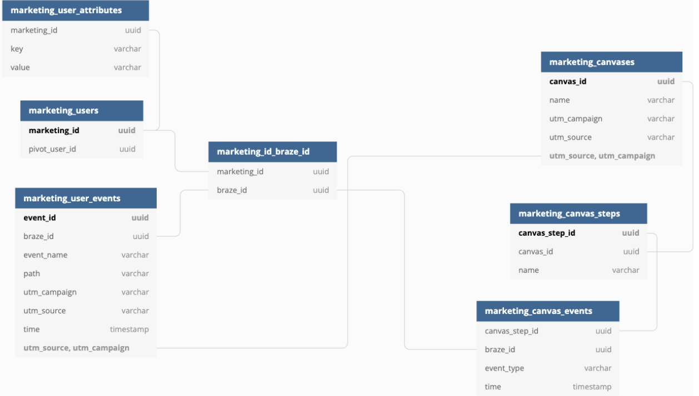

# Requirements

**Marketing would like the ability to display the following campaign data as a funnel:**

* From Email event data:  
  * sent  
  * delivered  
  * opened  
  * clicked  
* From User event data:  
  * landing page visit  
  * usage page visit  
  * ...all other pages  
  * registration

**Marketing would also like the ability to Filter and/or Breakdown by:**

* date range  
* campaign/canvas  
* attribute (i.e. org, tobacco list, age, gender, business\_site\_type, medical\_option, etc)

# Marketing data flow chart

  

# Proposed data structure

  

# Data population

* **Canvas data**  
  * Script to be run automatically as part of ETL job:  
    * get all Canvases within last X days: [GET: Canvas List](https://www.braze.com/docs/api/endpoints/export/canvas/get_canvases/)  
    * for each Canvas:  
      * get Canvas details: [GET: Canvas Details](https://www.braze.com/docs/api/endpoints/export/canvas/get_canvas_details/)  
* **User data**  
  * Script to be run automatically as part of ETL job:  
    * export Users by segment (all users, with all custom attributes): [POST: User Profile Export by Segment](https://www.braze.com/docs/api/endpoints/export/user_data/post_users_segment/)  
    * The Braze API will automatically send the export files to an S3 bucket that we specify within the Braze GUI  
* **Event data**  
  * Event data will be streamed to AWS (the same S3 bucket as above) via Braze Currents: [Braze Currents](https://www.braze.com/docs/user_guide/data_and_analytics/braze_currents/)

# User Attribute examples

* First name  
* Last name  
* Email  
* Org  
* Shipping address fields  
* Tobacco list (boolean)  
* Tobacco\_types (array)  
* Birthday (date) or age (int)

# Sample Braze Currents Record

{  
	"id": "0b4328a3-930a-435b-87c6-e867b9a1ee82",  
	"user\_id": "576b1edbd0a87b7e162018ca" (note: this is the braze\_id),  
	"external\_user\_id":  
	{  
		"string": "tesskafka"  
	},  
	"app\_id":  
	{  
		"string": "34e19c73-cb17-4b25-9300-f1cbcff58cfa"  
	},  
	"time": 1628778931,  
	"timezone":  
	{  
		"string": "America/Chicago"  
	},  
	"platform":  
	{  
		"string": "web"  
	},  
	"os\_version":  
	{  
		"string": "Mac"  
	},  
	"device\_model": null,  
	"device\_id":  
	{  
		"string": "4a109e79-291a-3119-af72-799669410903"  
	},  
	"name": "web\_reg\_page\_view",  
	"properties": "{\\"path\\":\\"/usage\\",\\"utm\_campaign\\":\\”FallEmail1\\”,\\"utm\_source\\":\\”target\\”}",  
	"ad\_id":  
	{  
		"string": "e7c295c0-a82f-4fca-9db9-4a5a378432cf"  
	},  
	"ad\_id\_type":  
	{  
		"string": "google\_ad\_id"  
	},  
	"ad\_tracking\_enabled":  
	{  
		"boolean": true  
	}  
}

# Query to filter and retrieve data

SELECT \* FROM (  
	/\* sub-query to get canvas events \*/  
	SELECT  
		sum(case when event\_name \= 'send' then 1 else 0 end) AS Sent,  
		sum(case when event\_name \= 'delivery' then 1 else 0 end) AS Delivered,  
		sum(case when event\_name \= 'open' then 1 else 0 end) AS Opened,  
		sum(case when event\_name \= 'click' then 1 else 0 end) AS Clicked  
	FROM braze\_canvas\_events CE  
	  
	/\* filter by user attribute \*/  
	/\*JOIN braze\_id\_marketing\_id BIMI  
	ON BIMI.braze\_id \= CE.braze\_id  
	JOIN braze\_users U  
	ON U.marketing\_id \= BIMI.marketing\_id  
	JOIN braze\_user\_attributes UA  
	ON UA.marketing\_id \= U.marketing\_id  
	AND UA.key \= 'gender'  
	AND UA.value \= 'F'\*/  
	  
	/\* filter by canvas\_id \*/  
	WHERE CE.canvas\_step\_id in (  
		SELECT canvas\_step\_id from braze\_canvas\_steps  
		WHERE canvas\_id \= 'db7a3e5c-6556-4b8f-acaf-8c8a904d9539'  
	)  
	/\* filter by date \*/  
	AND CE.time \> '2022-07-14'  
) as canvas\_events,  
(  
	/\* sub-query to get user events \*/  
	SELECT  
		sum(case when UE.event\_name \= 'web\_reg\_page\_view' and UE.path \= '/partner/target' then 1 else 0 end) AS LandingPage,  
		sum(case when UE.event\_name \= 'web\_reg\_clicked\_cta' then 1 else 0 end) AS ClickedCTA,  
		sum(case when UE.event\_name \= 'web\_reg\_page\_view' and UE.path \= '/eligibility' then 1 else 0 end) AS WelcomePage,  
		sum(case when UE.event\_name \= 'web\_reg\_page\_view' and UE.path \= '/usage' then 1 else 0 end) AS UsagePage,  
		sum(case when UE.event\_name \= 'web\_reg\_page\_view' and UE.path \= '/eligibility-primary' then 1 else 0 end) AS EligibilityPage,  
		sum(case when UE.event\_name \= 'web\_reg\_eligibility\_submitted' then 1 else 0 end) AS EligibilitySubmitted,  
		sum(case when UE.event\_name \= 'web\_reg\_eligibility\_passed' then 1 else 0 end) AS EligibilityPassed,  
		sum(case when UE.event\_name \= 'web\_reg\_page\_view' and UE.path \= '/create/credentials' then 1 else 0 end) AS ViewCreateAccount,  
		sum(case when UE.event\_name \= 'registered' then 1 else 0 end) AS Registered  
	FROM braze\_user\_events UE

	/\* filter by user attribute \*/  
	/\*JOIN braze\_id\_marketing\_id BIMI  
	ON BIMI.braze\_id \= UE.braze\_id  
	JOIN braze\_users U  
	ON U.marketing\_id \= BIMI.marketing\_id  
	JOIN braze\_user\_attributes UA  
	ON UA.marketing\_id \= U.marketing\_id  
	AND UA.key \= 'gender'  
	AND UA.value \= 'F'\*/  
	  
	/\* filter by canvas\_id \*/  
	WHERE UE.utm\_source in (  
		SELECT DISTINCT utm\_source from braze\_canvas\_steps  
		WHERE canvas\_id \= 'db7a3e5c-6556-4b8f-acaf-8c8a904d9539'  
	) AND UE.utm\_campaign in (  
		SELECT DISTINCT utm\_campaign from braze\_canvas\_steps  
		WHERE canvas\_id \= 'db7a3e5c-6556-4b8f-acaf-8c8a904d9539'  
	)  
	/\* filter by date \*/  
	AND UE.time \> '2022-07-14'

) as user\_events  
/\*  
select \* from braze\_canvas\_steps  
where canvas\_id \= '22e58fa8-d5fd-4133-87d0-ffcb64a7e20a'

select \* from braze\_user\_events  
where path \= '/partner/target'\*/

# Necessary tasks

* add utm\_campaign and utm\_source properties (if they exist) for each page visit event  
* update merge script to add previous braze\_id(s) (see note below)  
* create new tables in Analytics db  
* create script to pull canvas data from Braze and sync to Analytics db  
* create script to pull user data from Braze into S3  
* set up Currents in Braze to pull event data into S3  
* create scripts to populate/update the database after Braze data is retrieved  
  * User data  
  * User events  
* create task to run the service regularly/daily  
* create tableau workbook to display the data, with filters and breakdowns

# Notes

**To track braze IDs of merged profiles:**

* when profiles are merged, copy braze ID of old profile into new custom attribute (array) named: merged\_braze\_ids (previous\_braze\_ids?)  
* if old profile contains any merged\_braze\_ids, add them to the array as well  
* when pulling users from API, create table with 2 cols: marketing\_id & braze\_id  
  * for each user, add a record with the current braze\_id and any merged\_braze\_ids

# Script to pull user data from S3 into analytics database

**Limitations:**

* The only way to pull user data from Braze is by exporting a Segment  
* A segment can be created in Braze to pull all users with a marketing\_id (and optionally only users who have been updated since a certain timestamp)  
* A segment can’t be updated programmatically \- but we could manually update it after the initial run, so we don’t have to pull all 700k+ users every time  

